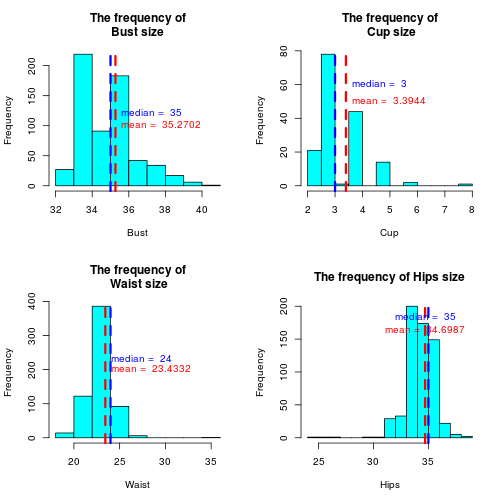

# Miss Playboy January 1991 is all-time popular model!

## Synopsis
Miss **[Stacy Arthur](http://en.wikipedia.org/wiki/Stacy_Arthur)** had the most popular body measurements (Bust, Cup, Waist, Hips, Height, Weight, BMI, WH) from 1975 toll 2008.
  
## The dataset

The data come from the following URL: http://archive.wired.com/wired/archive/17.02/1702_Infoporn_Playmate_Data.xls .

I used the following variables in analysis:

1. Bust - Bust size in inches
2. Cup - Cup size. US and Canada standards. ( [a=1, b=2, c=3, d=4, dd=5, ddd=6, e=7, ee=8](http://en.wikipedia.org/wiki/Brassiere_measurement#United_States_and_Canada) )
3. Waist - Waist size in inches
4. Hips - Hip size in inches
5. Height - in inches
6. Weight - in lb
7. BMI - [Body Mass Index](http://en.wikipedia.org/wiki/Body_mass_index)
8. WH - [Waist-hip ration](http://en.wikipedia.org/wiki/Waist%E2%80%93hip_ratio)

## 1. Data processing

The dataset is small so I prepared 8 new datasets which contain complete cases of each variable.


```r
library("xlsx")
library("lubridate")

## Download data
#url <- "http://archive.wired.com/wired/archive/17.02/1702_Infoporn_Playmate_Data.xls"
#download.file(url, destfile = "1702_Infoporn_Playmate_Data.xls")

## Read data
df <- read.xlsx("1702_Infoporn_Playmate_Data.xls", sheetIndex=1, startRow=1, endRow=663)
names(df) <- c("Month", "Year", "Bust", "Cup", "Waist", "Hips", "Height", "Weight", "BMI", "WH")

## Convert into numeric
for(i in 3:10) {
  df[,i] <- as.numeric(gsub('[A-Z a-z/]', '', df[,i]))
}

## Convert Year and Month into Date type
tmp <- paste(paste(df$Year, df$Month), "01")
df$Date <- as.Date(tmp, format="%Y %B %d")

## Find complete cases, make new data frames
tmp <- subset(df, complete.cases(df$Bust)==TRUE)
df_Bust <- tmp[!(tmp$Bust == "NOT LISTED"),]
df_Bust$Bust <- as.numeric(gsub('[A-Z a-z/]', '', df_Bust$Bust))

tmp <- subset(df, complete.cases(df$Cup)==TRUE)
df_Cup <- tmp[!(tmp$Cup == "NOT LISTED"),]

tmp <- subset(df, complete.cases(df$Waist)==TRUE)
df_Waist <- tmp[!(tmp$Waist == "NOT LISTED"),]
df_Waist$Waist <- as.numeric(gsub('[A-Z a-z/]', '', df_Waist$Waist))

tmp <- subset(df, complete.cases(df$Hips)==TRUE)
df_Hips <- tmp[!(tmp$Hips == "NOT LISTED"),]
df_Hips$Hips <- as.numeric(gsub('[A-Z a-z/]', '', df_Hips$Hips))

tmp <- subset(df, complete.cases(df$Height)==TRUE)
df_Height <- tmp[!(tmp$Height == "NOT LISTED"),]
df_Height$Height <- as.numeric(gsub('[A-Z a-z/]', '', df_Height$Height))

tmp <- subset(df, complete.cases(df$Weight)==TRUE)
df_Weight <- tmp[!(tmp$Weight == "NOT LISTED"),]
df_Weight$Weight <- as.numeric(gsub('[A-Z a-z/]', '', df_Weight$Weight))

tmp <- subset(df, complete.cases(df$BMI)==TRUE)
df_BMI <- tmp[!(tmp$BMI == 0),]

tmp <- subset(df, complete.cases(df$WH)==TRUE)
df_WH <- tmp[!(tmp$WH == 0),]
```

Let's look at the new datasets

```r
unique(df_Bust$Bust)
```

```
##  [1] 36.0 34.0 40.0 39.0 38.0 37.0 35.0 33.0 41.0 36.5 35.5 37.5 32.0 38.5
## [15] 34.5 33.5
```

```r
mm_bust <- c(mean(df_Bust$Bust), median(df_Bust$Bust))
mm_bust
```

```
## [1] 35.27016 35.00000
```

```r
unique(df_Cup$Cup)
```

```
## [1] 3.0 2.0 4.0 8.0 5.0 3.5 2.5 6.0
```

```r
mm_cup <- c(mean(df_Cup$Cup), median(df_Cup$Cup))
mm_cup
```

```
## [1] 3.39441 3.00000
```

```r
unique(df_Waist$Waist)
```

```
##  [1] 24.0 21.0 25.0 22.0 23.0 20.0 22.5 18.0 26.0 19.0 24.5 21.5 23.5 27.0
## [15] 35.0 28.0
```

```r
mm_waist <- c(mean(df_Waist$Waist), median(df_Waist$Waist))

unique(df_Hips$Hips)
```

```
##  [1] 36.0 35.0 32.0 37.0 34.0 33.0 36.5 39.0 38.0 35.5 33.5 34.5 37.5 26.0
## [15] 31.5 30.0 27.0 24.0 31.0
```

```r
mm_hips <- c(mean(df_Hips$Hips), median(df_Hips$Hips))
mm_hips
```

```
## [1] 34.69871 35.00000
```

```r
unique(df_Height$Height)
```

```
##  [1] 65.0 66.0 65.5 63.0 62.0 67.0 67.5 69.0 66.5 68.5 68.0 63.5 64.0 61.0
## [15] 64.5 60.0 72.0 62.5 59.0 70.0 71.0 73.0 69.5 60.5 70.5 74.0
```

```r
mm_height <- c(mean(df_Height$Height), median(df_Height$Height))
mm_height
```

```
## [1] 66.05726 66.00000
```

```r
unique(df_Weight$Weight)
```

```
##  [1] 118 125 115 105 122 128 106 120 117  98 124 100 135 110 130 126 112
## [18] 108 114 104 102 116 129 137 123 150 109 145 113 119 132  93 140 103
## [35] 133 121 107 143 127  95 101  94 138 111
```

```r
mm_weight <- c(mean(df_Weight$Weight), median(df_Weight$Weight))
mm_weight
```

```
## [1] 114.9361 115.0000
```

```r
mm_bmi <- c(mean(df_BMI$BMI), median(df_BMI$BMI))
mm_bmi
```

```
## [1] 18.50178 18.47939
```

```r
mm_wh <- c(mean(df_WH$WH), median(df_WH$WH))
mm_wh
```

```
## [1] 0.6759278 0.6764706
```
Looks good. Let's continue with some plotting.

## 2. Plot the frequencies of body measurements.

 

Hips size frequency looks strange. Let's dig into this.

List models whos hips size < 30''

```r
df_Hips[df_Hips$Hips < 30, c(1,2,3,4,5,6,7,8,9,10)]
```

```
##        Month Year Bust Cup Waist Hips Height Weight      BMI        WH
## 447 February 1991   36  NA    23   26     66    110 17.75253 0.8846154
## 593    April 2003   34   2    24   27     68    118 17.93988 0.8888889
## 614  January 2005   36   4    24   24     65    110 18.30296 1.0000000
```

Let's compare the hips size data of these models with data from Wikipedia.

1. Feb 1991 - Model name **[Cristy Thom](http://en.wikipedia.org/wiki/List_of_Playboy_Playmates_of_1991)**, real hips size: 36" - **incorrect**, need to fix in the dataset.
2. Apr 2003 - Model name **[Carmella DeCesare](http://en.wikipedia.org/wiki/Carmella_DeCesare)**, real hips size: 27 - **correct**
3. Jan 2005 - Modle name **[Destiny Davis](http://en.wikipedia.org/wiki/List_of_Playboy_Playmates_of_2005)**, real hips size: 34" - **incorrect**, need to fix in the dataset.


```r
## Fix Feb 1991
df_Hips[df_Hips$Hips == 26, ]$Hips <- 36

## Fix Jan 2005
df_Hips[df_Hips$Hips == 24, ]$Hips <- 34

unique(df_Hips$Hips)
```

```
##  [1] 36.0 35.0 32.0 37.0 34.0 33.0 36.5 39.0 38.0 35.5 33.5 34.5 37.5 31.5
## [15] 30.0 27.0 31.0
```

```r
mm_hips <- c(mean(df_Hips$Hips), median(df_Hips$Hips))
mm_hips
```

```
## [1] 34.73102 35.00000
```


## Find the model who has the most popular sizes of body measurement. 

### Here I just find the models who's sizes are the closest to mean values.

```r
prec <- 1
bust <- round(mean(df_Bust$Bust), digits = prec)
cup <- round(mean(df_Cup$Cup), digits = prec)
waist <- round(mean(df_Waist$Waist), digits = prec)
hips <- round(mean(df_Hips$Hips), digits = prec)
height <- round(mean(df_Height$Height), digits = prec)
weight <- round(mean(df_Weight$Weight), digits = prec)
bmi <- round(mean(df_BMI$BMI), digits = prec)
wh <- round(mean(df_WH$WH), digits = prec)

df1 <- subset(df, complete.cases(df)==TRUE)
range <- 1

df1[ 
  df1$Bust < bust+range & df1$Bust > bust-range &
  df1$Cup < cup+range & df1$Cup > cup-range &
  df1$Waist < waist+range & df1$Waist > waist-range &
  df1$Hips < hips+range & df1$Hips > hips-range &
  df1$Height < height+range & df1$Height > height-range &
  df1$Weight < weight+range & df1$Weight > weight-range &
  df1$BMI < bmi+range & df1$BMI > bmi-range &
  df1$WH < wh+range & df1$WH > wh-range 
, c(1,2,3,4,5,6,7,8,9,10)]
```

```
##       Month Year Bust Cup Waist Hips Height Weight      BMI        WH
## 446 January 1991   36   4    23   35     67    115 18.00958 0.6571429
```

Here I find that the model is **[Stacy Arthur](http://en.wikipedia.org/wiki/Stacy_Arthur)**

### Here I just find the models who's sizes are the closest to median values.

```r
bust <- round(median(df_Bust$Bust), digits = prec)
cup <- round(median(df_Cup$Cup), digits = prec)
waist <- round(median(df_Waist$Waist), digits = prec)
hips <- round(median(df_Hips$Hips), digits = prec)
height <- round(median(df_Height$Height), digits = prec)
weight <- round(median(df_Weight$Weight), digits = prec)
bmi <- round(median(df_BMI$BMI), digits = prec)
wh <- round(median(df_WH$WH), digits = prec)

range <- 1.001

df1[ 
    df1$Bust < bust+range & df1$Bust > bust-range &
    df1$Cup < cup+range & df1$Cup > cup-range &
    df1$Waist < waist+range & df1$Waist > waist-range &
    df1$Hips < hips+range & df1$Hips > hips-range &
    df1$Height < height+range & df1$Height > height-range &
    df1$Weight < weight+range & df1$Weight > weight-range &
    df1$BMI < bmi+range & df1$BMI > bmi-range &
    df1$WH < wh+range & df1$WH > wh-range 
  , c(1,2,3,4,5,6,7,8,9,10)]
```

```
##         Month Year Bust Cup Waist Hips Height Weight      BMI        WH
## 446   January 1991   36   4    23   35     67    115 18.00958 0.6571429
## 460     March 1992   34   3    23   34     66    116 18.72084 0.6764706
## 520     March 1997   36   3    24   34     65    114 18.96852 0.7058824
## 523      June 1997   34   4    24   34     66    114 18.39807 0.7058824
## 613  December 2004   34   3    23   35     66    115 18.55946 0.6571429
## 628     March 2006   36   3    24   36     66    114 18.39807 0.6666667
## 644      July 2007   34   4    24   34     67    115 18.00958 0.7058824
## 658 September 2008   34   4    25   36     67    115 18.00958 0.6944444
## 659   October 2008   34   3    24   34     65    115 19.13491 0.7058824
```

Here I find 9 models.

1. Jan 1992 - **[Stacy Arthur](http://www.boobpedia.com/boobs/Stacy_Arthur)**
2. March 1992 - **[Tylyn John](http://www.boobpedia.com/boobs/Tylyn_John)**
3. March 1997 - **[Jennifer Miriam](http://www.boobpedia.com/boobs/Jennifer_Miriam)**
4. June 1997 - **[Carrie Stevens](http://www.boobpedia.com/boobs/Carrie_Stevens)**
5. December 2004 - **[Tiffany Fallon](http://www.boobpedia.com/boobs/Tiffany_Fallon)**
6. March 2006 - **[Monica Leigh](http://www.boobpedia.com/boobs/Monica_Leigh)**
7. July 2007 - **[Tiffany Selby](http://www.boobpedia.com/boobs/Tiffany_Selby)**
8. September 2008 - **[Valerie Mason](http://www.boobpedia.com/boobs/Valerie_Mason)**
9. October 2008 - **[Kelly Carrington](http://www.boobpedia.com/boobs/Kelly_Carrington)**
